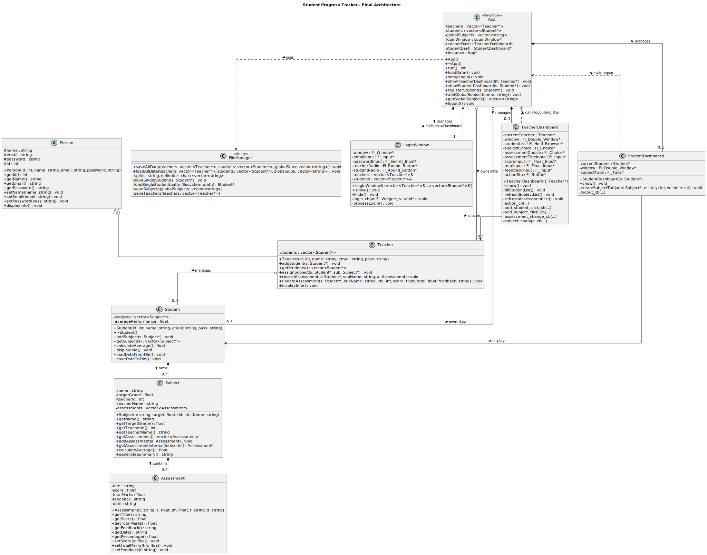

# 🎓 Student Progress Tracker (C++ / FLTK)

> A robust, self-contained desktop application for tracking academic performance, built with modern C++ and the FLTK GUI toolkit.


## 📖 Overview

The **Student Progress Tracker** is an Object-Oriented C++ application designed to bridge the gap between teachers and students. It provides a secure, local environment where:
* **Teachers** can manage student rosters, create subjects, and record detailed assessments (grades & feedback).
* **Students** can visualize their academic growth through interactive charts and review feedback.

The project emphasizes clean **OOP Architecture** (Polymorphism, Composition, Aggregation), **Data Persistence** (custom file-based database), and **Zero-Dependency Deployment** (FLTK is fetched automatically).

---

## ✨ Key Features

### 👨‍🏫 For Teachers
* **Roster Management:** Add new students dynamically via the dashboard.
* **Subject Management:** Create global subjects (e.g., "Mathematics", "Computer Science") available for assignment.
* **Assessment Tracking:**
    * Record grades, total marks, and qualitative feedback.
    * **Update Capability:** Correct mistakes in previous assessments easily.
* **Data Isolation:** Multiple teachers can teach the same subject name to the same student without data collision. (e.g., *Math (Mr. Smith)* vs *Math (Ms. Doe)*).

### 👨‍🎓 For Students
* **Visual Dashboard:** View performance bar charts for every enrolled subject.
* **Feedback View:** Read detailed comments from teachers for specific assignments.
* **GPA/Average Calculation:** Real-time calculation of overall performance percentages.

### 🛠 Technical Highlights
* **Self-Contained Database:** Uses a structured file system (`data/` folder) instead of SQL, making it portable and easy to debug.
* **Modern CMake Build:** Uses `FetchContent` to download and compile FLTK on the fly—no manual library installation required.
* **Robust Error Handling:** Safe inputs for numerical fields and corruption-resistant file loading.

---

## 🏗️ System Architecture




The project follows a strict **Model-View-Controller (MVC)** pattern adapted for desktop GUI.

### 1. The Model (Logic Layer)
* **`Person` (Abstract Base):** Defines common attributes (ID, Name, Email).
* **`Teacher` / `Student`:** Derived classes implementing specific roles.
* **`Subject`:** Contains assessments. It is **owned** by a Student but linked to a specific Teacher ID for data integrity.
* **`Assessment`:** Stores individual grade data.

### 2. The Controller (App Logic)
* **`App` Class:** A Singleton controller that orchestrates the application lifecycle. It owns the master data vectors and manages screen switching.
* **`FileManager`:** A static utility class that handles serialization/deserialization of data into the custom directory structure.

### 3. The View (GUI Layer)
* **`LoginWindow`:** Entry point validation.
* **`TeacherDashboard`:** Complex UI with Dropdowns (`Fl_Choice`), Popups (`Fl_Window`), and Browsers (`Fl_Hold_Browser`).
* **`StudentDashboard`:** Read-only view with `Fl_Tabs` and `Fl_Chart`.

---

## 📂 Data Storage Structure

The application acts as its own database engine. Data is stored in plain text for transparency:

```text
ProjectRoot/
└── data/
    ├── subjects.txt        # List of all available subjects
    ├── teachers.txt        # Credentials for all teachers
    └── students/           # Individual student records
        ├── 2001.txt        # Data for Student ID 2001
        ├── 2002.txt        # Data for Student ID 2002
        └── ...
```

*Note: The `data` folder is automatically created upon the first run.*

---

## 🚀 Getting Started

### Prerequisites
* **C++ Compiler:** GCC, Clang, or MSVC supporting **C++17**.
* **CMake:** Version 3.15 or higher.
* **Git:** To clone the repository.

### Installation & Build

1.  **Clone the Repository**
    ```bash
    git clone [https://github.com/yourusername/StudentProgressTracker.git](https://github.com/yourusername/StudentProgressTracker.git)
    cd StudentProgressTracker
    ```

2.  **Build with CMake**
    ```bash
    mkdir build
    cd build
    cmake ..
    cmake --build .
    ```
    *Note: The first build may take a few minutes as it downloads FLTK from GitHub.*

3.  **Run the Application**
    * **Windows:** `StudentProgressTracker.exe`
    * **Linux/Mac:** `./StudentProgressTracker`

---

## 🕹️ Usage Guide

### First Login (Default Admin)
When you run the app for the first time, a default teacher account is created:
* **Email:** `admin@school.com`
* **Password:** `password`

### Workflow
1.  **Log in** as the Admin Teacher.
2.  Click **"+ Add Student"** to register a new student (e.g., Alice).
3.  Click **"+ Create Subject"** to add a subject (e.g., "Physics").
4.  Select **Alice** from the list.
5.  Select **Physics** from the dropdown.
6.  Select **"Create New..."** in the assessment dropdown.
7.  Enter Title, Score, and Feedback, then click **Add Assessment**.
8.  **Logout** and log in as Alice (using the credentials you just created) to see the chart!
---

*Built with ❤️ using C++ and FLTK by Basil Saeed & Jaweria*
